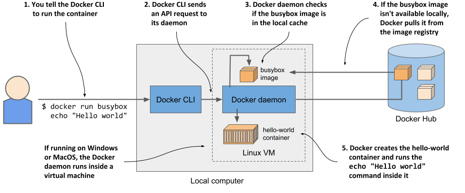
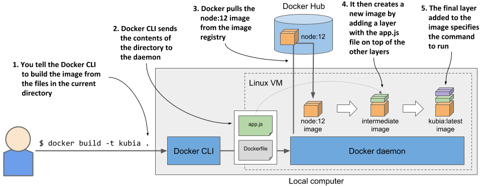
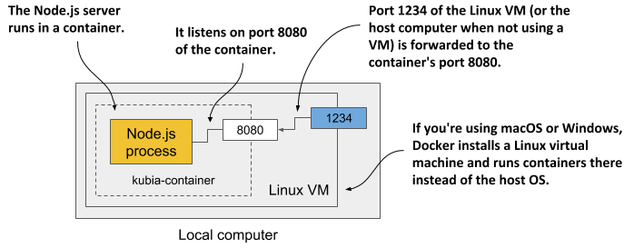

理想情况下，直接在Linux计算机上安装Docker，这样就不必处理在**宿主操作系统内运行**的**虚拟机**中**运行容器**的额外复杂性。但是，如果使用的是macOS或Windows，并且不知道如何设置Linux虚拟机，那么Docker Desktop应用程序可以完成设置。运行容器的Docker命令行（CLI）工具将安装在宿主操作系统上，但Docker守护进程（daemon）将在虚拟机内运行，它所创建的所有容器也将如此。

Docker平台由许多组件组成，但只需要安装Docker Engine即可运行容器。如果使用的是macOS或Windows，需要先安装Docker Desktop。Docker文档地址：[https://docs.docker.com/get-docker/](https://docs.docker.com/get-docker/)。

## 运行一个hello-world容器
为了回显'hello-world'，需要先从Docker Hub中拉取一个叫`busybox`的镜像。`busybox`是一个可执行文件，它结合了许多标准的UNIX命令行工具，如echo、ls、gzip。当然，还有其他的镜像可以做到执行回显命令。

可以使用单个`docker run`命令完成下载指定的映像和在其中运行的命令。要运行简单的Hello world容器，请执行以下列表中显示的命令：
```bash
$ docker run busybox echo "Hello World"
Unable to find image 'busybox:latest' locally
latest: Pulling from library/busybox
213a27df5921: Pull complete
Digest: sha256:9ae97d36d26566ff84e8893c64a6dc4fe8ca6d1144bf5b87b2b85a32def253c7
Status: Downloaded newer image for busybox:latest
Hello World
```

### 当运行容器的时候发生了什么？
下图展示了当运行`docker run`命令的时候发生了什么

将镜像下载到您的计算机后，Docker 守护进程根据该镜像创建了一个容器，并在其中执行了 echo 命令。该命令将文本打印到标准输出，然后进程终止，容器停止。

### 运行其他的镜像
运行其他现有的容器镜像与运行busybox镜像非常相似。实际上，它通常甚至更简单，因为通常不需要像在前面的示例中的echo命令那样指定要执行的命令。要执行的命令通常写在镜像本身中，但可以在运行时覆盖它。

例如，如果想运行Redis数据存储，可以在[http://hub.docker.com](http://hub.docker.com)或其他公共注册中心找到镜像名称。对于Redis来说，其中一个镜像被称为redis:alpine，所以可以像这样运行它：
```bash
$ docker run redis:alpine
```
### 理解容器tags
以redis容器为例，打开hub里redis的搜索结果[https://hub.docker.com/_/redis/tags](https://hub.docker.com/_/redis/tags)可以看到latest、buster, alpine，同样也有5.0.7-buster, 5.0.7-alpine等等。

Docker 允许你在同一名称下拥有同一镜像的多个版本或变体。每个变体都有一个唯一的标签（tag）。如果你引用镜像时没有明确指定标签，Docker 会假设你指的是特殊的 latest 标签。在上传一个新版本的镜像时，镜像的制作者通常会同时用实际的版本号以及 latest 来标记它。当你想要运行一个镜像的最新版本时，应该使用 latest 标签而不是指定具体的版本号。

即使是对于单个版本，镜像通常也有几种变体。对于 Redis5.0.7，有 5.0.7-buster 和 5.0.7-alpine。它们两个都包含相同版本的 Redis，但是它们所基于的基础镜像不同。5.0.7-buster 是基于 Debian 的“Buster”版本，而 5.0.7-alpine 是基于 Alpine Linux 基础镜像，这是一个非常精简的镜像，总共只有 5MB——它只包含了你在典型 Linux 发行版中看到的一小部分已安装二进制文件。

要运行镜像的特定版本和/或变体，请在镜像名称中指定标签。例如，要运行 5.0.7-alpine 标签的镜像，你将执行以下命令：
```bash
$ docker run redis:5.0.7-alpine
```

## 创建容器化的 Node.js Web 应用程序
下面创建一个简单的 Node.js Web 应用程序，并将其打包成一个容器镜像。这个应用程序将接受 HTTP 请求，并响应其正在运行的计算机的主机名。

这样，你将看到，尽管容器中的应用程序像其他任何进程一样在宿主机上运行，但它看到的主机名与宿主机的主机名不同。这在以后将应用程序部署到 Kubernetes 并进行扩展（水平扩展，即运行应用程序的多个实例）时非常有用。
```node.js
Listing 2.2 A simple Node.js web application: app.js
const http = require('http');
const os = require('os');

const listenPort = 8080;

console.log("Kubia server starting...");
console.log("Local hostname is " + os.hostname());
console.log("Listening on port " + listenPort);

var handler = function(request, response) {
  let clientIP = request.connection.remoteAddress;
  console.log("Received request for "+request.url+" from "+clientIP);
  response.writeHead(200);
  response.write("Hey there, this is "+os.hostname()+". ");
  response.write("Your IP is "+clientIP+". ");
  response.end("\n");
};

var server = http.createServer(handler);
server.listen(listenPort);
```

## 创建一个Dockerfile来构建容器映像
构建容器镜像的时候需要创建一个包含多个指令的dockfile。首先，构建一个app.js，文件内容如上所示。然后，创建一个Dockfile，文件内容包含如下指令：
```bash
FROM node:12
ADD app.js /app.js
ENTRYPOINT ["node", "app.js"]
```
``FROM`` 行定义了将要使用的容器镜像作为起点（即基础镜像）。在这个例子中，使用了 Node.js 的容器镜像，tag为12。在第二行中，将本地目录中的 app.js 文件以相同的名称（app.js）添加到镜像的根目录下。最后，在第三行中，指定了当执行镜像时 Docker 应该运行的命令，即``node app.js``。
为什么选择这个特定的镜像作为基础镜像。因为这个应用程序是一个 Node.js 应用程序，所以需要在镜像包含 node 二进制文件来运行该应用程序。也可以使用包含此二进制文件的任何镜像构造自己的镜像，甚至可以使用像 fedora 或 ubuntu 这样的 Linux 发行版基础镜像，并在构建镜像时将 Node.js 安装到容器中。但是，由于 node 镜像已经包含了运行 Node.js 应用程序所需的一切，因此从头开始构建镜像并没有意义。然而，在一些组织中，使用特定的基础镜像并在构建时向其添加软件可能是强制性的。

## 构建容器镜像
Dockerfile 和 app.js 文件是构建镜像所需的一切。现在，将使用下一个列表中的命令构建名为 kubia:latest 的镜像：
```
$ docker build -t kubia:latest .
```
-t 选项指定了所需的镜像名称和标签，末尾的点（.）指定了包含 Dockerfile 和构建上下文（构建过程所需的所有文件）的目录的路径。

当构建过程完成后，新创建的镜像将存储在计算机的本地镜像库中。可以通过列出本地镜像来查看它，如下面的列表所示：
```bash 
$ docker images
```
### 理解如何构建镜像（image）
下图展示了构建镜像的过程：

Docker CLI 工具本身并不执行构建操作。相反，整个目录的内容会上传到 Docker 守护进程（daemon），并由它来完成镜像的构建。CLI 工具和守护进程不一定在同一台计算机上。如果在非 Linux 系统（如 macOS 或 Windows）上使用 Docker，客户端位于主机操作系统（host os）中，但守护进程在 Linux 虚拟机内运行。但守护进程也可以在远程计算机上运行。

为了构建镜像，Docker 首先会从公共镜像仓库（在本例中为 Docker Hub）中拉取基础镜像（node:12），除非该镜像已经本地存储。然后，它会根据该镜像创建一个新的容器（container），并执行 Dockerfile 中的下一条指令。容器的最终状态会生成一个具有自己 ID 的新镜像。接着，构建过程会继续处理 Dockerfile 中剩余的指令。每条指令都会创建一个新的镜像。最后，最终的镜像会使用在 docker build 命令中通过 -t 标志指定的标签进行标记。

### 理解镜像中的层是什么
在构建镜像时，Dockerfile 中的每个单独指令都会创建一个新的层。

在构建 kubia 镜像的过程中，在拉取基础镜像的所有层之后，Docker 会创建一个新层，并将 app.js 文件添加到该层中。然后，它会再创建一个仅包含镜像执行时运行的命令的层。这个最后的层随后被标记为 kubia:latest。

您可以通过运行``docker history``来查看镜像的层及其大小，如下所示。首先打印最上层的层。
```bash 
$ docker history kubia:latest
IMAGE          CREATED          CREATED BY                                      SIZE      COMMENT
9e67beb141ec   51 seconds ago   ENTRYPOINT ["node" "app.js"]                    0B        buildkit.dockerfile.v0
<missing>      51 seconds ago   ADD app.js /app.js # buildkit                   617B      buildkit.dockerfile.v0
<missing>      2 years ago      /bin/sh -c #(nop)  CMD ["node"]                 0B
<missing>      2 years ago      /bin/sh -c #(nop)  ENTRYPOINT ["docker-entry…   0B
<missing>      2 years ago      /bin/sh -c #(nop) COPY file:4d192565a7220e13…   388B
<missing>      2 years ago      /bin/sh -c set -ex   && for key in     6A010…   7.72MB
<missing>      2 years ago      /bin/sh -c #(nop)  ENV YARN_VERSION=1.22.18     0B
<missing>      2 years ago      /bin/sh -c ARCH= && dpkgArch="$(dpkg --print…   73.2MB
<missing>      2 years ago      /bin/sh -c #(nop)  ENV NODE_VERSION=12.22.12    0B
<missing>      2 years ago      /bin/sh -c groupadd --gid 1000 node   && use…   336kB
<missing>      2 years ago      /bin/sh -c set -ex;  apt-get update;  apt-ge…   523MB
<missing>      2 years ago      /bin/sh -c apt-get update && apt-get install…   136MB
<missing>      2 years ago      /bin/sh -c set -ex;  if ! command -v gpg > /…   6.44MB
<missing>      2 years ago      /bin/sh -c set -eux;  apt-get update;  apt-g…   21.7MB
<missing>      2 years ago      /bin/sh -c #(nop)  CMD ["bash"]                 0B
<missing>      2 years ago      /bin/sh -c #(nop) ADD file:73f1db8536438ca89…   95.9MB
```
大多数层都来自 node:12 镜像。最上面的两层对应于 Dockerfile 中的第二个和第三个指令（ADD 和 ENTRYPOINT）。

正如在``CREATED BY`` 列中所看到的，每个层都是通过在容器中执行命令来创建的。除了使用 ``ADD`` 指令添加文件外，还可以在 ``Dockerfile`` 中使用其他指令。例如，RUN 指令在构建过程中在容器中执行命令。在上面的列表中有一个层，其中执行了 ``apt-get update`` 和一些附加的 ``apt-get`` 命令。``apt-get`` 是 ``Ubuntu`` 包管理器的一部分，用于安装软件包。列表中显示的命令将一些软件包安装到镜像的文件系统中。

要了解 ``RUN`` 和可以在 ``Dockerfile`` 中使用的其他指令，请参阅 ``Dockerfile`` 参考文档，网址为：https://docs.docker.com/engine/reference/builder/

## 运行容器镜像
现在镜像已经构建并准备就绪，可以使用以下命令运行容器：
```bash 
zhangcaiwang@bogon:k8s/kubia $ docker run --name kubia-container -p 1234:8080 -d kubia
2cecb6b0fd74d2620836bda63e01e48690065fa86036761ae70efa3ff639e42a
zhangcaiwang@bogon:k8s/kubia $
```
这条命令告诉 Docker 从 kubia 镜像中运行一个新容器，名为 kubia-container。容器与控制台分离（由 -d 标志指定），并在后台运行。宿主机上的 1234 端口被映射到容器中的 8080 端口（由 -p 1234:8080 选项指定），因此您可以通过 http://localhost:1234 访问应用程序。

下图展示了上面的case是如何发生的，其运行在非linux操作系统上。


### 访问刚才创建的app
```bash
$ curl localhost:1234
Hey there, this is 2cecb6b0fd74. Your IP is ::ffff:172.17.0.1.
```
其中，2cecb6b0fd74即是容器的主机名。

### 列出所有运行中的容器
要列出当前正在运行的所有容器，可以执行下面的命令
```bash 
$ docker ps
CONTAINER ID   IMAGE                                 COMMAND                  CREATED          STATUS          PORTS                                                                                                                                  NAMES
2cecb6b0fd74   kubia                                 "node app.js"            10 minutes ago   Up 10 minutes   0.0.0.0:1234->8080/tcp                                                                                                                 kubia-container
aa6284a5aeec   gcr.io/k8s-minikube/kicbase:v0.0.44   "/usr/local/bin/entr…"   4 weeks ago      Up 4 weeks      127.0.0.1:53846->22/tcp, 127.0.0.1:53847->2376/tcp, 127.0.0.1:53849->5000/tcp, 127.0.0.1:53850->8443/tcp, 127.0.0.1:53848->32443/tcp   minikube
```

### 获取容器的额外信息
docker ps 命令显示关于容器的最基本信息。要查看额外信息，您可以使用 docker inspect：
```bash 
$ docker inspect kubia-container
```
Docker 会打印出一个很长的 JSON 格式文档，其中包含有关容器的许多信息，例如其状态、配置和网络设置（包括 IP 地址）。

### 检查应用程序日志
Docker 捕获并存储应用程序写入标准输出和错误流的所有内容。这通常是应用程序写入日志的地方。您可以使用 docker logs 命令来查看输出，如下面的列表所示。

```bash 
 docker logs kubia-container
Kubia server starting...
Local hostname is 2cecb6b0fd74
Listening on port 8080
Received request for / from ::ffff:172.17.0.1
Received request for /favicon.ico from ::ffff:172.17.0.1
Received request for / from ::ffff:172.17.0.1
```
## 分发容器镜像（Distributing container images）
前面构建的镜像目前仅可在本地使用。若要在其他计算机上运行它，必须将其推送到外部镜像仓库。如果将其推送到公共的 ``Docker Hub`` 仓库，这样您就不需要设置私有仓库了。当然也可以使用其他仓库，比如 Quay.io，或者 Google 容器仓库。

在推送镜像之前，必须根据 ``Docker Hub`` 的镜像命名规则重新标记它。镜像名称必须包含自己的 Docker Hub ID，该 ID 是在注册 [http://hub.docker.com ](http://hub.docker.com)时选择的。

## 为镜像添加额外的标签
如下方式，使用**注册中心id/镜像名:tag**的形式可以为镜像添加标签：
```bash 
$ docker tag kubia zhangcaiwang/kubia:1.0
```
通过再次列出镜像来确认现在这个镜像有两个名称，如下所示
```bash 
$ docker images | head
REPOSITORY                    TAG       IMAGE ID       CREATED         SIZE
kubia                         latest    9e67beb141ec   2 hours ago     864MB
zhangcaiwang/kubia            1.0       9e67beb141ec   2 hours ago     864MB
```
如上所示，kubia和zhangcaiwang/kubia:1.0有相同的image id，也就是说，这是一个镜像有两个名字。

### 推送镜像到Docker Hub中
在将镜像推送到 Docker Hub 之前，必须使用 docker login 命令和用户 ID 登录，如下所示：
```bash 
$ docker login -u zhangcaiwang -p ******  docker.io
```
登录完成后，使用下面的命令将镜像推送到hub中
```bash 
$ docker push yourid/kubia:1.0
```

## 停止运行容器并删除
### 停止运行容器
如果需要停止容器运行，需要执行下面的命令
```bash 
docker stop kubia-container
```
这会给容器中的主进程发送一个终止信号，以便它可以优雅地关闭。如果进程没有响应终止信号或没有及时关闭，Docker 会将其杀死。当容器中的顶级进程终止时，容器中就没有其他进程在运行了，因此容器会停止。

### 删除容器
停止运行容器后它仍然存在。Docker 会保留它，并可以通过``docker start kubia-container``重启。可以通过运行 docker ps -a 来查看已停止的容器。-a 选项会打印出所有容器——正在运行的容器和已停止的容器。
要删除容器，可以运行以下 docker rm 命令：
```bash 
$ docker rm kubia-container
```

执行后容器的所有内容都将被移除，并且无法再启动。不过，镜像仍然存在。如果你决定再次创建容器，则无需再次下载镜像。如果你还想删除镜像，请使用 docker rmi 命令：
```bash
$ docker rmi kubia:latest
```


<br>
<br>
