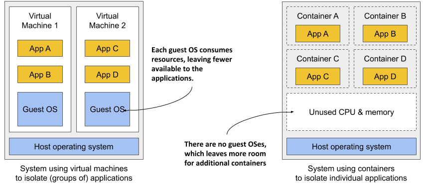
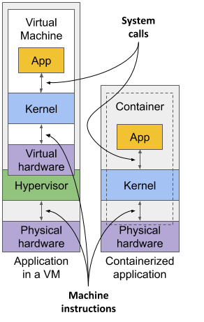
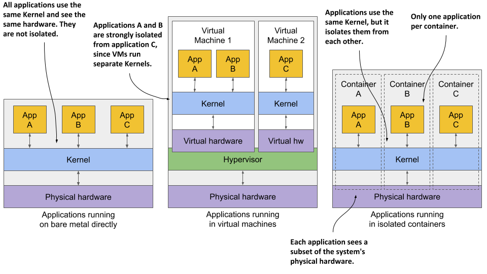
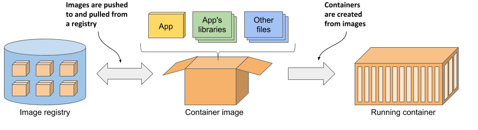

当系统只有少量应用的时候，为每一个应用分配一个虚拟机并把应用运行在该虚拟机的系统上是没问题的。但是当使用微服务的时候，应用数量不断上升，这个时候再使用刚才的策略将消耗特别多的硬件资源，花费也是高昂的。 
此外，每个虚拟机通常都需要单独配置和管理，这意味着运行更多的虚拟机也会导致对人员配置提出更高要求，并需要更好的、往往也更复杂的自动化系统。由于向微服务架构的转变，系统由数百个已部署的应用程序实例组成，因此需要虚拟机的替代品。容器就是这样的替代品。 

## 对比容器和虚拟机
与使用虚拟机来隔离各个微服务（或一般软件进程）的环境不同，现在大多数开发和运营团队更喜欢使用容器。它们允许您在同一台主机计算机上运行多个服务，同时保持它们彼此隔离。与虚拟机相似，但开销要小得多。 
与每个都运行一个带有多个系统进程的独立操作系统的虚拟机不同，在容器中运行的进程在现有的主机操作系统内运行。由于只有一个操作系统，因此不存在重复的系统进程。尽管所有的应用程序进程都在同一个操作系统中运行，但它们的环境是隔离的，尽管隔离程度不如在单独的虚拟机中运行它们时好。对于容器中的进程而言，这种隔离使其看起来就像计算机上不存在其他进程一样。 

### 容器和虚拟机的开销对比
与虚拟机相比，容器要轻得多，因为它们不需要单独的资源池或任何额外的操作系统级进程。每个虚拟机通常都运行自己的一套系统进程，这些进程除了用户应用程序自己的进程所消耗的资源外，还需要额外的计算资源，但容器只是在现有主机操作系统中运行的一个隔离进程，它只消耗应用程序所消耗的资源。

下图显示了两台裸机计算机（bare metal computer），一台运行两个虚拟机，另一台则运行容器。后者有空间容纳额外的容器，因为它只运行一个操作系统，而第一台则运行三个——一个主机操作系统和两个guest操作系统。

由于虚拟机的资源开销，你通常会将多个应用程序分组到每个虚拟机中。你无法承担为每个应用程序分配一个完整的虚拟机的费用。但是容器不会引入任何开销，这意味着你可以承担为每个应用程序创建一个单独的容器的费用。事实上，你永远不应该在同一个容器中运行多个应用程序，因为这会使管理容器中的进程变得更加困难。此外，包括Kubernetes本身在内的所有处理容器的现有软件，都是在容器中只有一个应用程序的前提下设计的。

### 容器和虚拟机的启动时间对比
除了较低的运行时开销外，容器还能更快地启动应用程序，因为只需要启动应用程序进程本身。与启动新虚拟机时需要首先启动额外的系统进程不同，容器不需要这样做。

### 容器和虚拟机的隔离对比（isolation）
就资源使用而言，容器显然更胜一筹，但也存在一个缺点。当在虚拟机中运行应用程序时，每个虚拟机都会运行自己的操作系统和内核。在这些虚拟机之下是超管理器（以及可能的一个额外的操作系统），它将物理硬件资源分割成较小的虚拟资源集，供每个虚拟机中的操作系统使用。如下图所示，在这些虚拟机中运行的应用程序会对虚拟机中的客户操作系统内核发出`系统调用`，然后内核在虚拟CPU上执行的机器指令会通过超管理器转发给主机的物理CPU。

另一方面，所有容器都在宿主操作系统中运行的单一内核上进行系统调用。这个单一内核是宿主CPU上唯一执行指令的实体。CPU不需要像处理虚拟机那样处理任何形式的虚拟化。

在第一种情况下，所有三个应用程序都使用相同的内核，并且完全没有隔离。在第二种情况下，应用程序A和B在同一个虚拟机中运行，因此共享内核，而应用程序C则完全与其他两个隔离，因为它使用自己的内核。它只与前两个共享硬件。

第三种情况显示了三个应用程序在容器中运行。尽管它们都使用相同的内核，但它们彼此隔离，并且完全不知道其他应用程序的存在。隔离是由内核本身提供的。每个应用程序只看到物理硬件的一部分，并且将自己视为操作系统中唯一运行的进程，尽管它们都在同一个操作系统中运行。

### 理解容器隔离的安全性影响
使用虚拟机而不是容器的主要优势是它们提供的完全隔离性，因为每个虚拟机都有自己的Linux内核，而所有容器都使用同一个内核。这明显会带来安全风险。如果内核中存在漏洞，一个容器中的应用程序可能会利用它来读取其他容器中应用程序的内存。如果应用程序在不同的虚拟机上运行，因此只共享硬件，那么此类攻击的可能性要低得多。当然，只有在不同的物理机器上运行应用程序才能实现完全隔离。

此外，容器共享内存空间，而每个虚拟机都使用自己的内存块。因此，如果不限制容器可以使用的内存量，这可能会导致其他容器内存不足或将其数据交换到磁盘上。

### 理解容器和虚拟机的工作原理
虚拟机是通过CPU中的虚拟化支持和宿主机上的虚拟化软件来启用的，容器是由Linux内核本身启用的。

## 介绍Docker容器平台
虽然容器技术已经存在很长时间了，但它们只是随着Docker的兴起才变得广为人知。Docker是第一个使容器能够轻松地在不同计算机之间移植的容器系统。它简化了将应用程序及其所有库和其他依赖项（甚至整个操作系统文件系统）打包成一个简单、可移植的包的过程，该包可用于在任何运行Docker的计算机上部署应用程序。

### 介绍容器、镜像和注册中心（container、image、registry）
Docker是一个用于打包、分发和运行应用程序的平台。如前所述，它允许您将应用程序及其整个环境一起打包。这可能只是应用程序所需的一些动态链接库，或者是随操作系统一起提供的所有文件。Docker允许您通过公共存储库将此包分发到任何启用了Docker的计算机上。

- **Image**：容器镜像是您将应用程序及其环境打包成的东西，类似于一个压缩文件或归档文件。它包含了应用程序将使用的整个文件系统以及额外的元数据，比如当镜像被执行时运行的可执行文件的路径、应用程序监听的端口，以及关于镜像的其他信息。
- **Registry**：
- **Container**：
    

 
 

