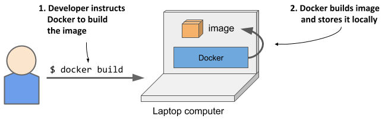
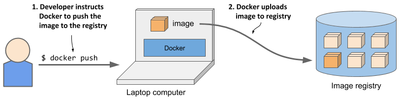
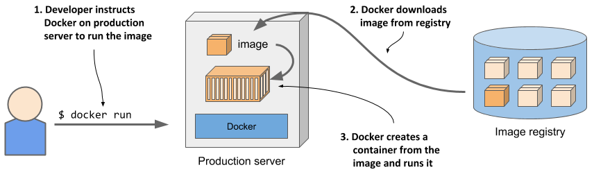
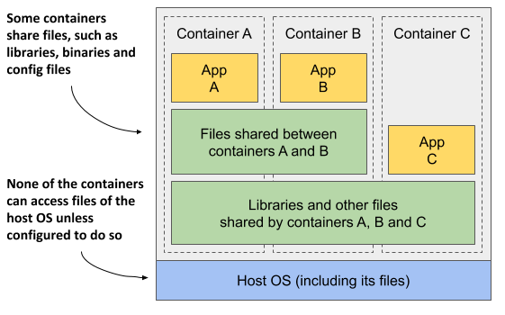
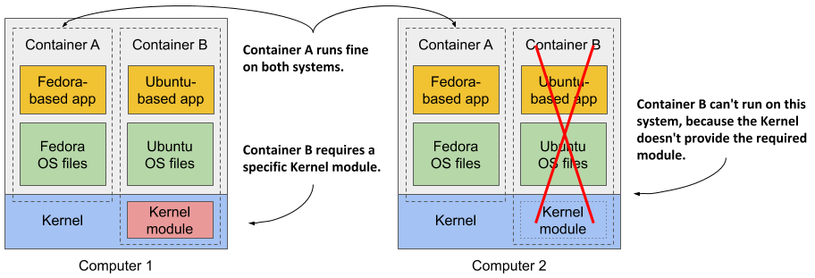

当系统只有少量应用的时候，为每一个应用分配一个虚拟机并把应用运行在该虚拟机的系统上是没问题的。但是当使用微服务的时候，应用数量不断上升，这个时候再使用刚才的策略将消耗特别多的硬件资源，花费也是高昂的。 
此外，每个虚拟机通常都需要单独配置和管理，这意味着运行更多的虚拟机也会导致对人员配置提出更高要求，并需要更好的、往往也更复杂的自动化系统。由于向微服务架构的转变，系统由数百个已部署的应用程序实例组成，因此需要虚拟机的替代品。容器就是这样的替代品。 

## 对比容器和虚拟机
与使用虚拟机来隔离各个微服务（或一般软件进程）的环境不同，现在大多数开发和运营团队更喜欢使用容器。它们允许您在同一台主机计算机上运行多个服务，同时保持它们彼此隔离。与虚拟机相似，但开销要小得多。 
与每个都运行一个带有多个系统进程的独立操作系统的虚拟机不同，在容器中运行的进程在现有的主机操作系统内运行。由于只有一个操作系统，因此不存在重复的系统进程。尽管所有的应用程序进程都在同一个操作系统中运行，但它们的环境是隔离的，尽管隔离程度不如在单独的虚拟机中运行它们时好。对于容器中的进程而言，这种隔离使其看起来就像计算机上不存在其他进程一样。 

### 容器和虚拟机的开销对比
与虚拟机相比，容器要轻得多，因为它们不需要单独的资源池或任何额外的操作系统级进程。每个虚拟机通常都运行自己的一套系统进程，这些进程除了用户应用程序自己的进程所消耗的资源外，还需要额外的计算资源，但容器只是在现有主机操作系统中运行的一个隔离进程，它只消耗应用程序所消耗的资源。

下图显示了两台裸机计算机（bare metal computer），一台运行两个虚拟机，另一台则运行容器。后者有空间容纳额外的容器，因为它只运行一个操作系统，而第一台则运行三个——一个主机操作系统和两个guest操作系统。

由于虚拟机的资源开销，你通常会将多个应用程序分组到每个虚拟机中。你无法承担为每个应用程序分配一个完整的虚拟机的费用。但是容器不会引入任何开销，这意味着你可以承担为每个应用程序创建一个单独的容器的费用。事实上，你永远不应该在同一个容器中运行多个应用程序，因为这会使管理容器中的进程变得更加困难。此外，包括Kubernetes本身在内的所有处理容器的现有软件，都是在容器中只有一个应用程序的前提下设计的。

### 容器和虚拟机的启动时间对比
除了较低的运行时开销外，容器还能更快地启动应用程序，因为只需要启动应用程序进程本身。与启动新虚拟机时需要首先启动额外的系统进程不同，容器不需要这样做。

### 容器和虚拟机的隔离对比（isolation）
就资源使用而言，容器显然更胜一筹，但也存在一个缺点。当在虚拟机中运行应用程序时，每个虚拟机都会运行自己的操作系统和内核。在这些虚拟机之下是超管理器（以及可能的一个额外的操作系统），它将物理硬件资源分割成较小的虚拟资源集，供每个虚拟机中的操作系统使用。如下图所示，在这些虚拟机中运行的应用程序会对虚拟机中的客户操作系统内核发出`系统调用`，然后内核在虚拟CPU上执行的机器指令会通过超管理器转发给主机的物理CPU。

另一方面，所有容器都在宿主操作系统中运行的单一内核上进行系统调用。这个单一内核是宿主CPU上唯一执行指令的实体。CPU不需要像处理虚拟机那样处理任何形式的虚拟化。

在第一种情况下，所有三个应用程序都使用相同的内核，并且完全没有隔离。在第二种情况下，应用程序A和B在同一个虚拟机中运行，因此共享内核，而应用程序C则完全与其他两个隔离，因为它使用自己的内核。它只与前两个共享硬件。

第三种情况显示了三个应用程序在容器中运行。尽管它们都使用相同的内核，但它们彼此隔离，并且完全不知道其他应用程序的存在。隔离是由内核本身提供的。每个应用程序只看到物理硬件的一部分，并且将自己视为操作系统中唯一运行的进程，尽管它们都在同一个操作系统中运行。

### 理解容器隔离的安全性影响
使用虚拟机而不是容器的主要优势是它们提供的完全隔离性，因为每个虚拟机都有自己的Linux内核，而所有容器都使用同一个内核。这明显会带来安全风险。如果内核中存在漏洞，一个容器中的应用程序可能会利用它来读取其他容器中应用程序的内存。如果应用程序在不同的虚拟机上运行，因此只共享硬件，那么此类攻击的可能性要低得多。当然，只有在不同的物理机器上运行应用程序才能实现完全隔离。

此外，容器共享内存空间，而每个虚拟机都使用自己的内存块。因此，如果不限制容器可以使用的内存量，这可能会导致其他容器内存不足或将其数据交换到磁盘上。

### 理解容器和虚拟机的工作原理
虚拟机是通过CPU中的虚拟化支持和宿主机上的虚拟化软件来启用的，容器是由Linux内核本身启用的。

## 介绍Docker容器平台
虽然容器技术已经存在很长时间了，但它们只是随着Docker的兴起才变得广为人知。Docker是第一个使容器能够轻松地在不同计算机之间移植的容器系统。它简化了将应用程序及其所有库和其他依赖项（甚至整个操作系统文件系统）打包成一个简单、可移植的包的过程，该包可用于在任何运行Docker的计算机上部署应用程序。

### 介绍容器、镜像和注册中心（container、image、registry）
Docker是一个用于打包、分发和运行应用程序的平台。如前所述，它允许您将应用程序及其整个环境一起打包。这可能只是应用程序所需的一些动态链接库，或者是随操作系统一起提供的所有文件。Docker允许您通过公共存储库将此包分发到任何启用了Docker的计算机上。

- **Image**：容器镜像是您将**应用程序**及其**环境**打包成的东西，类似于一个压缩文件或归档文件。它包含了应用程序将使用的整个**文件系统**以及额外的**元数据**，比如当镜像被执行时运行的可执行文件的路径、应用程序监听的端口，以及关于镜像的其他信息。
- **Registry**：注册中心是容器镜像的存储库，它使不同的人和计算机之间能够交换镜像。在构建镜像后，您可以在同一台计算机上运行它，或者将镜像推送到注册中心（上传），然后再将其拉取（下载）到另一台计算机。某些注册中心是公开的，允许任何人从中拉取镜像，而其他注册中心是私有的，仅对拥有必要身份验证凭据的个人、组织或计算机开放。
- **Container**：容器是根据容器镜像实例化的。正在运行的容器是主机操作系统中运行的一个正常进程，但其环境与主机环境和其他进程的环境相隔离。容器的文件系统源自容器镜像，但也可以将其他文件系统挂载到容器中。容器通常受到资源限制，意味着它只能访问和使用为其分配的CPU和内存等资源量。

### 构建、分发和运行容器镜像
下面的几个图展示了容器镜像构建、分发、和运行的流程，同时也可以看出他们之前的关系。

### 理解应用程序所看到的环境
当在容器中运行应用程序时，它会看到打包到容器镜像中的文件系统内容，以及挂载到容器中的任何额外文件系统。无论应用程序是在笔记本电脑上运行还是在功能完备的生产服务器上运行，它看到的文件都是相同的，即使生产服务器使用的是完全不同的Linux发行版也是如此。应用程序通常无法访问主机操作系统中的文件，因此服务器的已安装依赖与开发计算机完全不同也没关系。

例如，如果将您的应用程序与整个Red Hat Enterprise Linux（RHEL）操作系统的文件一起打包，然后运行它，应用程序会认为自己是在RHEL内部运行，无论您是在基于Fedora的计算机上还是基于Debian的计算机上运行它。主机上安装的Linux发行版无关紧要。唯一可能重要的是内核版本和它加载的内核模块。

这与通过创建新的虚拟机、在其中安装操作系统和应用程序，然后分发整个虚拟机镜像以便其他人可以在不同的主机上运行它的方式来创建VM镜像类似。Docker达到了相同的效果，但它不是使用虚拟机来实现应用程序的隔离，而是使用Linux容器技术来达到（几乎）相同的隔离级别。

### 理解镜像层（Image Layers）
虚拟机镜像包含了安装在虚拟机中的操作系统所需的整个文件系统的庞大数据块，而容器镜像则由通常小得多的层组成。这些层可以在多个镜像之间共享和重用。这意味着，如果主机里包含相同层的另一个镜像已经下载了这些相同层，那么其他的镜像只需要下载其他未下载过的层。

层（Layers）使得镜像分发非常高效，同时也有助于减少镜像的存储占用。Docker 只存储每个层一次。如下图所示，两个由包含相同层的镜像创建的容器使用相同的文件。这意味着，尽管你可能有多个镜像，但它们共享某些层，这些层在磁盘上只被存储一次，而不是每个镜像都存储一份。这种机制不仅减少了磁盘空间的占用，还加快了镜像的加载速度，因为系统只需要加载那些在特定容器中实际被使用的层。

图示表明容器A和B共享一个镜像层，这意味着应用程序A和B会读取一些相同的文件。此外，它们还与容器C共享底层。但是，如果这三个容器都能访问相同的文件，那么它们是如何完全彼此隔离的呢？应用程序A对存储在共享层中的文件所做的更改对应用程序B不可见吗？它们是不可见的。原因如下：

文件系统通过写时复制（Copy-on-Write，简称CoW）机制实现隔离。容器的文件系统由容器镜像中的只读层和一个堆叠在顶部的额外读写层组成。当在容器A中运行的应用程序更改只读层中的一个文件时，整个文件会被复制到容器的读写层中，并在那里更改文件内容。由于每个容器都有自己的可写层，因此对共享文件的更改在任何其他容器中都是不可见的。

当你删除一个文件时，它只是在读写层中被标记为已删除，但它仍然存在于一个或多个底层中。因此，删除文件永远不会减小镜像的大小。

### 了解容器映像的可移植性限制
理论上，基于Docker的容器镜像可以在任何运行Docker的Linux计算机上运行，但存在一个小小的注意事项，因为容器没有自己的内核。如果容器化应用程序需要特定版本的内核，那么它可能无法在每台计算机上运行。如果计算机运行的是不同版本的Linux内核或未加载所需的内核模块，则应用程序无法在该计算机上运行。

容器B需要特定的内核模块才能正常运行。这个模块在第一台计算机的内核中已加载，但在第二台计算机中未加载。您可以在第二台计算机上运行容器镜像，但当它尝试使用缺失的模块时会出错。

而且，这不仅仅是关于内核及其模块的问题。还应该明确的是，为特定硬件架构构建的容器化应用程序只能在具有相同架构的计算机上运行。不能将一个为x86 CPU架构编译的应用程序放入容器中，并期望它在基于ARM的计算机上运行仅仅因为那里运行着Docker。为此，需要一个虚拟机来模拟x86架构。

 
 

