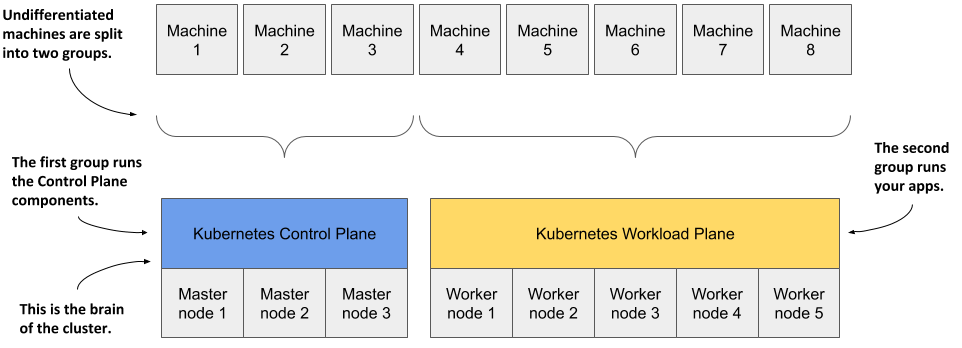
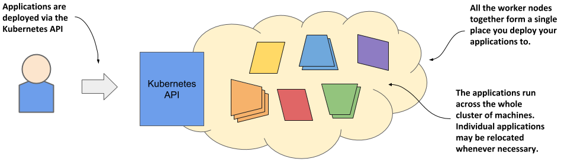
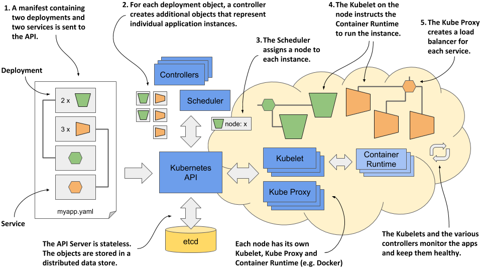

# 理解k8s如何如何转换计算机集群
## Kubernetes就像计算机集群的操作系统
如下图所示，正如操作系统支持计算机的基本功能，如将进程调度到CPU上，并作为**应用程序**与**计算机硬件**之间的接口，Kubernetes将分布式应用程序的组件调度
到底层计算机集群中的各个计算机上，并作为**应用程序**与**集群**之间的接口。 
 

它使应用程序开发人员无需在应用程序中实现与基础设施相关的机制；相反，他们依赖Kubernetes来提供这些功能。这包括：
>服务发现 - 一种机制，允许应用程序找到其他应用程序并使用它们提供的服务  
>水平扩展 - 通过复制应用程序来适应负载波动  
>负载均衡 - 将负载分布到所有应用程序副本上  
>自我修复 - 通过自动重启失败的应用程序并在其节点失败后将其移动到健康的节点上来保持系统健康  
>领导者选举 - 一种机制，用于决定哪个应用程序实例应该处于活动状态，而其他实例则保持空闲但准备好在活动实例失败时接管。  

## Kubernetes如何融入计算机集群
为了获得一个关于Kubernetes如何部署到计算机集群中的具体示例，请查看下图。  
    
 
你首先会有一组机器，你将这些机器分为两组——主节点和工作节点。主节点将运行Kubernetes控制平面，它代表系统的“大脑”并控制集群， 而其余节点将运行你的应用程序——即你的工作负载——因此将代表工作负载平面。 

非生产集群可以使用单个主节点，但高可用集群至少使用三个物理主节点来承载控制平面。工作节点的数量取决于您要部署的应用程序的数量。 

## 所有集群节点如何成为一个大型部署区域
在计算机上安装 Kubernetes 后，部署应用程序时不再需要考虑单个计算机。无论集群中工作节点的数量是多少，它们都将成为部署应用程序的单一空间。
可以使用Kubernetes API来实现这一点，该API是由Kubernetes控制平面提供的。 
 

这里说的所有节点是一个整体，并不是说可以将一个很大的应用部署在多个节点上。而且也不必在意应用最终部署在了哪个节点上，  因为k8s可能在你不知情的时候把应用从一个节点移动到另外一个节点上，这也不是部署者需要知道到事儿。 

# 使用k8s的好处
## 开发者自助部署应用程序(Self-service development)
以前部署应用都是由专门的人员部署，有了k8s以后，程序可以自己通过k8s部署。他们不需要了解节点多少和节点的性能，也不用知道部署在哪个节点上，k8s将根据应用的需要的资源和节点可用的资源选择部署的节点。 

## 通过更好的基础设施利用率降低成本
k8s可以比人更快速地找到哪个应用更适合部署在哪个节点上，通过在一台服务器上部署多个不同的服务，k8s提高了硬件的利用率，以至于可以在更少的服务器上部署更多的应用。 

## 自动调整以适应不断变化的负载
k8s通过监控每个应用消耗的资源和其他指标，可以自动调整每个程序的实例数以应对负载或者使用资源的增加。开发者也不用担心会使用完资源，因为k8s可以通过云供应商的api提供额外的节点。 

## 保持应用程序平稳运行
1.当你当程序崩溃或者因为代码bug导致内存溢出，k8s可以自动为你重启应用，保证服务可以正常对外提供服务。
2.当硬件出现故障时，k8s可以将你的应用迁移到正常到节点上。
3.如果资源足够，哪怕是节点半夜出现了故障，k8s也会自动处理，运维同学则可以睡个好觉啦。

## 简化程序部署
Kubernetes 提供了与基础设施相关的服务，这些服务在没有 Kubernetes 的情况下需要在自己的应用程序中实现。这包括在分布式应用程序中发现服务和/或对等节点、领导者选举、集中式应用程序配置等。Kubernetes 在提供这些服务的同时，保持了对应用程序的“无 Kubernetes 感知”特性，但当需要时，应用程序也可以查询 Kubernetes API 以获取有关其环境的详细信息。它们还可以使用 API 来更改环境。 

# Kubernetes集群的架构
k8s集群里的节点被分成了两组：
1.由master节点组成的控制面板集群，是系统的大脑，控制整个集群。
2.运行应用的一组负载面板。

 

## 控制面板组件（control plane） 
k8s的控制面板由多个组件构成，这些组件运行在master节点上，为了提高可用性，也可能运行在多个master节点上。 

下面是控制面板里的组件和他们的功能：
> **API Server**：提供了 RESTful 风格的 Kubernetes API，工程师通过此api创建对象。它提供了 REST API 供集群内部组件和外部客户端（如 kubectl、kubelet 等）进行通信和交互。
> **etcd**：etcd分布式存储服务存储了通过api创建的对象，以及存储 Kubernetes 集群的所有配置数据，如 API 对象的状态信息。
> **调度器**：决定每个应用程序实例应在哪个工作节点上运行
> **控制器（Controllers）**：通过 API 激活创建的对象。它们中的大多数只是创建其他对象，但也有一些与外部系统（例如，通过其 API 与云提供商）进行通信。

## 工作节点组件（worker node）
工作组件上运行了我们的应用程序，也运行了一些k8s组件，这些组件提供了运行程序、监控、程序之间的连接等功能。
下图展示了工作节点上运行等k8s组件。 

下面是运行的k8s组件
> **Kubelet**：是一个与API服务器通信并管理其节点上运行的应用程序的代理。它通过API报告这些应用程序和节点的状态。
> **容器运行时（Container Runtime）**：可以是Docker或任何与Kubernetes兼容的其他运行时（runtime）。它根据Kubelet的指示在容器中运行应用程序。
> **Kubernetes服务代理（Kube-Proxy）**：负责在应用程序之间负载均衡网络流量。尽管它的名字暗示流量会流经它，但实际上已经不再是这样了。Kube-Proxy的主要作用是通过网络规则来确保服务间的通信，而不是直接代理或转发流量。

## 附加组件（add-on)
大多数Kubernetes集群还包含其他几个组件，包括DNS服务器、网络插件、日志代理等。这些组件通常运行在工作节点上，但也可以配置为在主节点上运行。这些组件共同协作，以确保Kubernetes集群的顺利运行和高效管理。例如，DNS服务器负责集群内的服务发现，网络插件管理集群的网络配置和通信，而日志代理则负责收集和分析集群中应用程序的日志信息。 

# k8s是如何运行一个程序的
## 定义应用程序
在Kubernetes中，一切都被表示为对象，且通过Kubernetes API创建和检索这些对象。应用程序由这些对象的几种类型组成——一种类型代表整个应用程序的部署，另一种类型代表应用程序的**一个**正在运行的实例，还有一种类型代表由这些实例集合提供的服务，并允许通过单个IP地址访问它们，此外还有许多其他类型。 
下图展示了通过创建一个清单文件来部署应用程序的示例，该清单文件包含两个部署，并通过两个服务对外暴露这两个部署。 

部署应用程序的时候会发生下面的动作：
- 你将应用程序清单提交给Kubernetes API。API服务器将清单中定义的对象写入etcd。
- 一个控制器注意到新创建的对象，并为每个应用程序实例创建了一个新对象。
- 调度器为每个实例分配一个节点。
- Kubelet注意到有一个实例被分配给了Kubelet的节点。它通过容器运行时（docker）运行应用程序实例。
- Kube Proxy注意到应用程序实例已准备好接受来自客户端的连接，并为它们配置了一个负载均衡器。
- Kubelets和控制器监视系统并保持应用程序运行。

## 将应用程序提交给API
创建好yaml或者json文件后，通过API提交文件，通常是通过k8s的终端命令工具`kubectl`来完成。 
Kubectl 会将文件拆分成单独的对象，并通过向 API 发送 HTTP PUT 或 POST 请求来创建每个对象，这通常是 RESTful API 的工作方式。API 服务器会验证这些对象，并将它们存储在 etcd 数据存储中。此外，它还会通知所有感兴趣的组件这些对象已被创建。接下来会解释的控制器（Controllers）就是这些组件之一。 

## 关于控制器（Controller）
大多数对象类型都有一个关联的控制器。控制器关注特定类型的对象。它会等待 API 服务器通知它新对象已被创建，然后执行操作以激活该对象。通常，控制器只是通过相同的 Kubernetes API 创建其他对象。例如，负责应用程序部署的控制器会创建一个或多个代表应用程序单独实例的对象。控制器创建的对象数量取决于应用程序部署对象中指定的副本数量。 

## 关于调度器（Scheduler）
调度器是一种特殊类型的控制器，其唯一任务是将应用程序实例调度到工作节点上。它为每个新的应用程序实例对象选择最佳的工作节点，并通过 API 修改对象来将该节点分配给实例。 

## 关于Kubelet和Container Runtime
在每个工作节点上运行的``Kubelet``也是一种控制器。它的任务是等待应用程序实例被分配到它所在的节点上，并运行该应用程序。这是通过指示容器运行时（container runtime）启动应用程序的容器来完成的。 

## 关于Kube Proxy
由于应用程序部署可能包含多个应用程序实例，因此需要一个负载均衡器来将它们暴露在单个 IP 地址下。Kube Proxy 是与 Kubelet 一起运行的另一个控制器，负责设置负载均衡器。 

## 保持应用程序健康
一旦应用程序启动并运行，Kubelet 会在应用程序终止时通过重启它来保持其健康。它还会通过更新代表应用程序实例的对象来报告应用程序的状态。其他控制器会监视这些对象，并确保如果它们的节点出现故障，则将应用程序移动到健康的节点上。 

 
 
 

