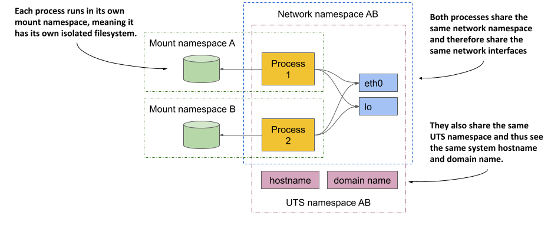
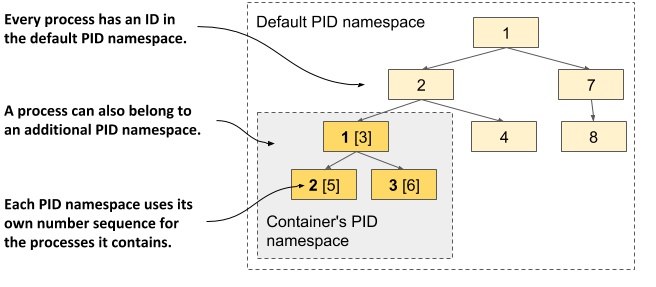

第一个特性称为``Linux命名空间``，它确保每个进程都有自己对系统的独立视图。这意味着，在容器中运行的进程将只能看到系统上的部分文件、进程和网络接口，以及一个不同的系统主机名，就好像它在一个独立的虚拟机中运行一样。

对于命名空间，可以参考这篇文章[https://cizixs.com/2017/08/29/linux-namespace/](https://cizixs.com/2017/08/29/linux-namespace/)

在Linux操作系统中，最初所有可用的系统资源，如文件系统、进程ID、用户ID、网络接口等，都位于同一个“桶（bucket）”中，所有进程都可以看到和使用这些资源。但是，内核允许你创建额外的“桶”，这些“桶”被称为命名空间（namespace），并将资源移动到这些命名空间中，以便它们被组织成更小的集合。这允许你使每个集合仅对一个进程或一组进程可见。当你创建一个新进程时，你可以指定它应该使用哪个命名空间。该进程只能看到该命名空间中的资源，而无法看到其他命名空间中的资源。

### 介绍可用的命名空间类型
命名空间并非只有一种类型。实际上有几种类型——每种资源类型对应一种。因此，一个进程不仅使用一个命名空间，而是每种类型使用一个命名空间。

存在以下类型的命名空间：
- 挂载命名空间（Mount namespace，mnt）隔离挂载点（文件系统）。 
- 进程ID命名空间（Process ID namespace pid）隔离进程ID。 
- 网络命名空间（Network namespace，net）隔离网络设备、网络栈、端口等。 
- 进程间通信命名空间（Inter-process communication namespace，ipc）隔离进程之间的通信（这包括隔离消息队列、共享内存等）。 
- UNIX时间共享系统命名空间（UNIX Time-sharing System namespace，UTS）隔离系统主机名和网络信息服务（NIS）域名。 
- 用户ID命名空间（User ID namespace ，user）隔离用户和组ID。 
- Cgroup命名空间（Cgroup namespace）隔离控制组根目录。

### 使用网络命名空间为进程分配专用的网络接口集合
进程运行的网络命名空间决定了该进程可以看到哪些网络接口。每个网络接口只能属于一个命名空间，但可以从一个命名空间移动到另一个命名空间。如果每个容器使用自己的网络命名空间，那么每个容器看到的将是自己的网络接口集合。

下图展示了解网络命名空间如何用于创建容器，运行容器化进程并为其提供一组仅该进程可以使用的专用网络接口。

最初，只有默认的网络命名空间存在。接着，你为容器创建两个新的网络接口和一个新的网络命名空间。这些接口可以从默认命名空间移动到新的命名空间。一旦在新的命名空间中，它们可以被重命名，因为名称只需在每个命名空间内唯一。最后，可以在这个网络命名空间中启动进程，使其只能看到为其创建的两个接口。

仅通过查看可用的网络接口，进程无法判断自己是在容器中、虚拟机中还是直接在裸机上运行的操作系统中。

### 使用 UTS 命名空间为进程分配专用的主机名
另一个使进程看起来像是在自己的主机上运行的例子是使用 UTS 命名空间。它决定了运行在该命名空间中的进程看到的主机名和域名。通过为两个不同的进程分配两个不同的 UTS 命名空间，你可以使它们看到不同的系统主机名。对于这两个进程来说，它们看起来就像是在两台不同的计算机上运行。

### 了解命名空间如何将进程彼此隔离
通过为所有可用的命名空间类型创建一个专用的命名空间实例并将其分配给一个进程，你可以使该进程相信它正在自己的操作系统中运行。主要原因在于，每个进程都有其自己的环境。一个进程只能看到和使用其自身命名空间中的资源，不能使用其他命名空间中的资源。同样，其他进程也无法使用它的资源。这就是容器如何隔离在其中运行的进程环境的方式。

### 在多个进程之间共享命名空间
有时候并不总是希望完全隔离容器。相关的容器可能会希望共享某些资源。下图展示了两个进程的例子，这两个进程共享相同的网络接口以及系统的主机名和域名，但不共享文件系统。

首先关注共享的网络设备。这两个进程看到并使用相同的两个网络设备（eth0 和 lo），因为它们使用相同的网络命名空间。这使得它们能够绑定到相同的 IP 地址并通过回环设备进行通信，就像它们在不使用容器的机器上运行一样。这两个进程也使用相同的 UTS 命名空间，因此看到相同的系统主机名。相比之下，它们各自使用自己的挂载命名空间，这意味着它们有独立的文件系统。

总之，进程可能希望共享某些资源但不是所有资源。这是可能的，因为存在不同的命名空间类型。每个进程都有与每种类型相关联的命名空间。

考虑到这一切，人们可能会问容器到底是什么？一个“在容器中”运行的进程，并不是在一个类似虚拟机的实际封闭环境中运行。它只是一个被分配了七个命名空间（每种类型一个）的进程。部分命名空间与其他进程共享，而其他的则不共享。这意味着进程之间的边界并不完全一致。

## 探索【正在运行的容器】的环境
如果你想查看容器内部的环境，例如系统主机名、本地 IP 地址、文件系统上可用的二进制文件和库等，你可以像处理虚拟机一样，通过运行容器内的 shell 来探索这些特性。你可以使用``docker exec`` 命令进入容器内部，并执行相应的命令。

### 在现有容器中运行一个 shell
前面创建的镜像所基于的 ``Node.js`` 镜像提供了 ``bash shell``，这意味着你可以使用以下命令在容器中运行它
```bash 
$ docker start kubia-container
$ docker exec -it kubia-container bash
root@2cecb6b0fd74:/#
```
这个命令会在现有的 kubia-container 容器中以额外的进程运行 bash。这个进程与主容器进程（运行中的 Node.js 服务器）共享相同的 Linux 命名空间。这样，你可以从内部探索容器，查看 Node.js 和你的应用在容器中运行时如何看待系统。-it 选项是两个选项的简写：
- -i 告诉 Docker 以交互模式运行命令。
- -t 告诉 Docker 分配一个伪终端（TTY），以便你可以正确使用 shell。
如果你想按照习惯的方式使用shell，那你需要同时使用这两个选项。如果你省略了第一个选项，你将无法执行任何命令；如果你省略了第二个选项，命令提示符将不会出现，并且一些命令可能会报错，提示TERM变量未设置。

### 列出容器中的运行进程
让我们通过在容器中运行的shell中执行 ``ps aux`` 命令来列出容器中的运行进程。以下列表显示了该命令的输出。
```bash 
root@2cecb6b0fd74:/# ps aux
USER       PID %CPU %MEM    VSZ   RSS TTY      STAT START   TIME COMMAND
root         1  0.0  0.3 550504 27876 ?        Ssl  11:45   0:00 node app.js
root        19  0.0  0.0   3744  2944 pts/0    Ss   11:45   0:00 bash
root        25  0.0  0.0   5860  2376 pts/0    R+   11:54   0:00 ps aux
```
这个列表只显示了三个进程。这些是容器中唯一运行的进程。你无法看到主机操作系统或其他容器中运行的其他进程，因为容器运行在其自己的进程ID命名空间中。

### 在主机的进程列表中查看容器进程
如果你现在打开另一个终端并列出主机操作系统中的进程，你也会看到容器中运行的进程。这确认了容器中的进程实际上是主机操作系统中运行的常规进程，如下所示。
```bash 
» ps aux | grep app.js
zhangcaiwang     94268   0.0  0.0 408628368   1648 s002  S+    9:45下午   0:00.00 grep --color=auto --exclude-dir=.bzr --exclude-dir=CVS --exclude-dir=.git --exclude-dir=.hg --exclude-dir=.svn --exclude-dir=.idea --exclude-dir=.tox app.js
```
不过，除了上面的这个进程，容器里的其他进程是看不到的。

如果你留心观察，你可能会发现容器中的进程ID与主机上的不同。由于容器使用自己的进程ID命名空间，它拥有自己的进程树和ID号序列。正如下图所示，这棵树是主机完整进程树的一个子树。因此，每个进程有两个ID。


### 容器的文件系统与主机和其他容器隔离
与隔离的进程树一样，每个容器也有一个隔离的文件系统。如果你列出容器根目录的内容，只会显示容器中的文件。这包括容器镜像中的文件以及在容器运行期间创建的文件，例如日志文件。

要离开容器，可以通过运行 ``exit`` 命令或按 ``Control-D`` 键退出 shell，你将返回到主机计算机（类似于退出 ssh 会话）。

## 使用 Linux 控制组限制进程的资源使用
Linux 命名空间使得进程只能访问主机的一部分资源，但它们无法限制每个进程可以消耗多少单一资源。例如，你可以使用命名空间来允许进程只访问特定的网络接口，但无法限制该进程消耗的网络带宽。同样，你也不能使用命名空间来限制进程可用的 CPU 时间或内存。你可能希望这样做，以防止一个进程消耗所有的 CPU 时间，从而阻碍关键系统进程的正常运行。为此，我们需要 Linux 内核的另一个功能，即cgroups。

### 介绍cgroups
使容器成为可能的第二个 Linux 内核功能叫做 Linux 控制组（Linux Control Groups，cgroups）。它限制、统计和隔离系统资源，例如 CPU、内存和磁盘或网络带宽。使用 cgroups 时，进程或进程组只能使用分配的 CPU 时间、内存和网络带宽。这样，进程无法占用预留给其他进程的资源。

### 限制容器对 CPU 的使用
如果你不对容器的 CPU 使用施加任何限制，它将对主机上的所有 CPU 核心拥有无限制的访问权限。你可以通过 Docker 的 ``--cpuset-cpus`` 选项明确指定容器可以使用哪些核心。例如，要允许容器仅使用核心一和核心二，你可以使用以下选项运行容器：
```bash 
$ docker run --cpuset-cpus="1,2" ...
```
你还可以使用选项 ``--cpus``、``--cpu-period``、``--cpu-quota`` 和 ``--cpu-shares`` 来限制可用的 CPU 时间。例如，要允许容器仅使用一个 CPU 核心的一半，你可以按如下方式运行容器：
```bash 
$ docker run --cpus="0.5" ...
```

### 限制容器对内存的使用
与 CPU 一样，容器可以使用所有可用的系统内存，就像任何常规的操作系统进程一样，但你可能希望对其进行限制。Docker 提供了以下选项来限制容器的内存和交换空间使用：``--memory``、``--memory-reservation``、``--kernel-memory``、``--memory-swap`` 和 ``--memory-swappiness``。

例如，要将容器中可用的最大内存大小设置为 100MB，可以按如下方式运行容器（m 代表兆字节）：
``` 
$ docker run --memory="100m" ...
```
所有这些 Docker 选项只是配置进程的 cgroups。是内核负责限制进程可用的资源。

### 加强容器之间的隔离
Linux Namespaces 和 Cgroups 将容器的环境隔离开来，并防止一个容器耗尽其他容器的计算资源。但这些容器中的进程使用相同的系统内核，因此不能说它们是真正隔离的。一个恶意的容器可能会发出恶意系统调用，从而影响其邻近的容器。

想象一个 Kubernetes 节点上运行着多个容器。每个容器都有自己的网络设备和文件，并且只能消耗有限的 CPU 和内存。乍一看，一个容器中的恶意程序无法对其他容器造成损害。但如果恶意程序修改了所有容器共享的系统时钟呢？

根据应用程序的不同，修改时间可能不会造成太大问题，但允许程序执行任何系统调用到内核则几乎可以做任何事情。系统调用允许它们修改内核内存、添加或移除内核模块，以及其他许多普通容器不应执行的操作。

### 赋予容器对系统的完全权限
操作系统内核提供了一组系统调用，程序通过这些调用来与操作系统和底层硬件进行交互。这些调用包括创建进程、操作文件和设备、在应用程序之间建立通信通道等。

其中一些系统调用相对安全，任何进程都可以使用，但其他调用则仅保留给具有高权限的进程。以之前给出的示例为例，运行在Kubernetes节点上的应用程序应该被允许打开其本地文件，但不应被允许更改系统时钟或以破坏其他容器的方式修改内核。

大多数容器应以无提升权限的方式运行。只有那些您信任且确实需要高权限的程序才应在具有特权的容器中运行。

### 使用能力（Capabilities）来授予容器一组权限的子集
如果一个应用程序只需要调用一些需要高权限的系统调用，那么创建一个具有完全权限的容器并不理想。幸运的是，Linux 内核还将权限划分为称为能力的单元。能力的例子包括：

- CAP_NET_ADMIN 允许进程执行与网络相关的操作，
- CAP_NET_BIND_SERVICE 允许进程绑定到小于 1024 的端口号，
- CAP_SYS_TIME 允许进程修改系统时钟，等等。

在创建容器时，可以添加或移除（丢弃）capabilities。每项capability代表容器内进程可用的一组权限。Docker 和 Kubernetes 会丢弃除典型应用程序所需的capabilities之外的所有capabilities，但用户如果有权限，可以添加或丢弃其他capabilities。

### 使用 seccomp 配置文件来过滤单个系统调用
如果你需要更精细地控制程序可以执行哪些系统调用，可以使用 seccomp（Secure Computing Mode，安全计算模式）。你可以通过创建一个列出容器允许执行的系统调用的 JSON 文件来创建自定义 seccomp 配置文件。然后，在创建容器时，将该文件提供给 Docker。

### 使用 AppArmor 和 SELinux 加固容器
容器还可以通过两种额外的强制访问控制（MAC）机制来增强安全性：SELinux（安全增强 Linux）和 AppArmor（应用程序防护）。

使用 SELinux，你可以将标签附加到文件和系统资源，以及用户和进程上。用户或进程只有在所有相关的主体和对象的标签与一组策略匹配时，才能访问某个文件或资源。AppArmor 类似，但使用文件路径而不是标签，并且更侧重于进程而非用户。
<br>
<br>
<br>