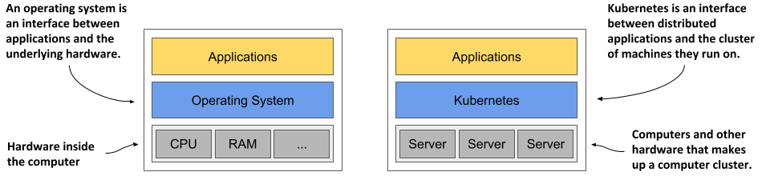
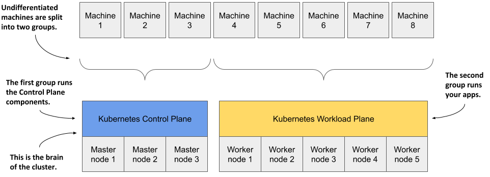
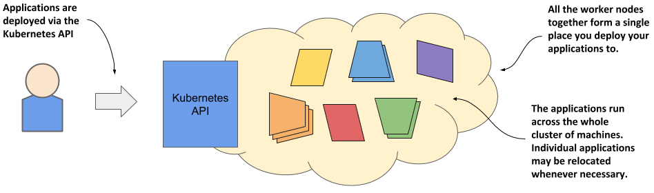

# 理解k8s如何如何转换计算机集群
## Kubernetes就像计算机集群的操作系统
如下图所示，正如操作系统支持计算机的基本功能，如将进程调度到CPU上，并作为**应用程序**与**计算机硬件**之间的接口，Kubernetes将分布式应用程序的组件调度
到底层计算机集群中的各个计算机上，并作为**应用程序**与**集群**之间的接口。 
 

它使应用程序开发人员无需在应用程序中实现与基础设施相关的机制；相反，他们依赖Kubernetes来提供这些功能。这包括：
>服务发现 - 一种机制，允许应用程序找到其他应用程序并使用它们提供的服务  
>水平扩展 - 通过复制应用程序来适应负载波动  
>负载均衡 - 将负载分布到所有应用程序副本上  
>自我修复 - 通过自动重启失败的应用程序并在其节点失败后将其移动到健康的节点上来保持系统健康  
>领导者选举 - 一种机制，用于决定哪个应用程序实例应该处于活动状态，而其他实例则保持空闲但准备好在活动实例失败时接管。  

## Kubernetes如何融入计算机集群
为了获得一个关于Kubernetes如何部署到计算机集群中的具体示例，请查看下图。  
    
 
你首先会有一组机器，你将这些机器分为两组——主节点和工作节点。主节点将运行Kubernetes控制平面，它代表系统的“大脑”并控制集群，
而其余节点将运行你的应用程序——即你的工作负载——因此将代表工作负载平面。 

非生产集群可以使用单个主节点，但高可用集群至少使用三个物理主节点来承载控制平面。工作节点的数量取决于您要部署的应用程序的数量。 

## 所有集群节点如何成为一个大型部署区域
在计算机上安装 Kubernetes 后，部署应用程序时不再需要考虑单个计算机。无论集群中工作节点的数量是多少，它们都将成为部署应用程序的单一空间。
您可以使用Kubernetes API来实现这一点，该API是由Kubernetes控制平面提供的。 
 

这里说的所有节点是一个整体，并不是说可以将一个很大的应用部署在多个节点上。而且也不必在意应用最终部署在了哪个节点上，
因为k8s可能在你不知情的时候把应用从一个节点移动到另外一个节点上，这也不是部署者需要知道到事儿。 

# 使用k8s的好处

